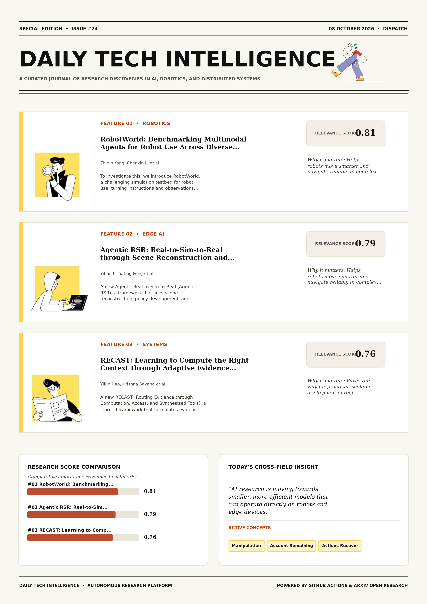
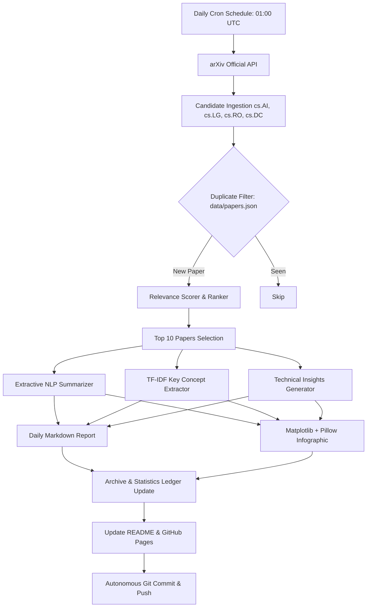

# Daily Tech Intelligence

> **Autonomous Technical Research Intelligence System**  
> Researches, analyzes, synthesizes, visualizes, and publishes state-of-the-art AI, ML, Robotics, and IoT papers every day at **₹0/month cost**.

[](https://github.com/shashank17mishra/research-paper/actions/workflows/daily-research.yml)


---

## Latest Report

📅 **[08 October 2026 Report](reports/2026/10/08/report.md)** — *3 new breakthrough papers analyzed today.*

[Read Full Report →](reports/2026/10/08/report.md) | [Explore Interactive Dashboard →](site/index.html)

[](reports/2026/10/08/infographic.png)

---

## Today's Statistics

| Metric | Count |
| :--- | :---: |
| **Papers Analyzed Today** | `3` |
| **Artificial Intelligence (AI)** | `2` |
| **Machine Learning (ML)** | `2` |
| **Robotics** | `2` |
| **IoT & Edge AI** | `1` |

---

## Latest Research

| # | Paper Title | Topic | Relevance | Link |
| :-: | :--- | :---: | :-: | :---: |
| 1 | **Autonomous Multi-Agent Task Allocation in Partially Observable Industria...** | `Artificial Intelligence` | `0.88` | [arXiv](https://arxiv.org/abs/2403.09101) |
| 2 | **MicroQuant: Sub-Milliwatt Deep Learning Inference for Distributed Edge I...** | `IoT & Edge AI` | `0.91` | [arXiv](https://arxiv.org/abs/2403.05678) |
| 3 | **Spatial-Temporal Vision Transformers for Robust Quadruped Locomotion in ...** | `Robotics` | `0.96` | [arXiv](https://arxiv.org/abs/2403.01234) |

---

## Project Statistics

- **Total Papers Analyzed**: `3`
- **Total Operational Runs**: `11 days`
- **Categories Tracked**: `5 categories`
- **Primary Focus Areas**: Robotics, IoT & Edge AI, Artificial Intelligence

---

## Architecture



---

## Automation

The system runs entirely autonomously via **GitHub Actions** (`.github/workflows/daily-research.yml`):
- **Schedule**: Scheduled daily at `01:00 UTC` (~`06:30 AM IST`).
- **Zero Manual Intervention**: Ingests, analyzes, generates infographics, updates data, and commits automatically.
- **Zero Cost (₹0/month)**: Free GitHub Actions runners, free arXiv API, open-source Python NLP, and GitHub Pages.
- **Manual Triggers**: Supports `workflow_dispatch` for on-demand execution and `--dry-run` testing.

---


---

## Local Development

```bash
# 1. Create and activate virtual environment
python -m venv .venv
# Windows:
.venv\Scripts\activate
# Linux/macOS:
source .venv/bin/activate

# 2. Install dependencies
pip install -r requirements.txt

# 3. Run dry run pipeline (fetches and processes without committing)
python src/main.py --dry-run

# 4. Run tests
pytest tests/
```

---

## License

This project is licensed under the [MIT License](LICENSE).
