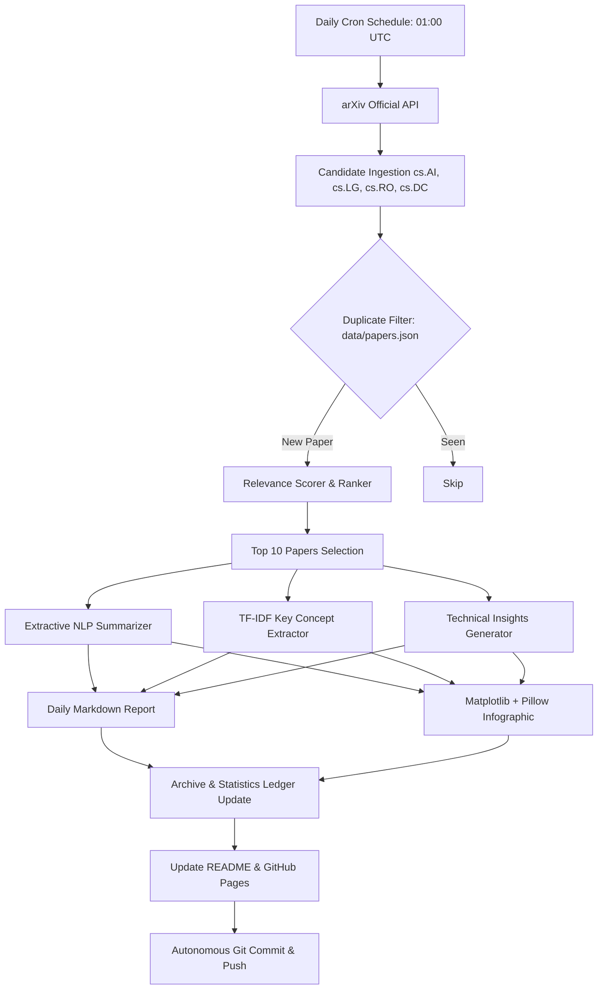

# Daily Tech Intelligence

> **Autonomous Technical Research Intelligence System**  
> Researches, analyzes, synthesizes, visualizes, and publishes state-of-the-art AI, ML, Robotics, and IoT papers every day at **₹0/month cost**.

[](https://github.com/shashank17mishra/research-paper/actions/workflows/daily-research.yml)


---

## Latest Report

📅 **[08 October 2026 Report](reports/2026/10/08/report.md)** — *5 new breakthrough papers analyzed today.*

[Read Full Report →](reports/2026/10/08/report.md) | [Explore Interactive Dashboard →](site/index.html)

[](reports/2026/10/08/infographic.png)

---

## Today's Statistics

| Metric | Count |
| :--- | :---: |
| **Papers Analyzed Today** | `5` |
| **Artificial Intelligence (AI)** | `3` |
| **Machine Learning (ML)** | `4` |
| **Robotics** | `2` |
| **IoT & Edge AI** | `0` |

---

## Latest Research

| # | Paper Title | Topic | Relevance | Link |
| :-: | :--- | :---: | :-: | :---: |
| 1 | **Rephrase Before You Act: Characterizing and Mitigating Language Sensitiv...** | `Machine Learning` | `0.69` | [arXiv](https://arxiv.org/abs/2610.10526v1) |
| 2 | **SOTA: Stock Options Trading Agents Guided by Option-Implied Return Distr...** | `Machine Learning` | `0.70` | [arXiv](https://arxiv.org/abs/2610.10407v1) |
| 3 | **A Good Self-Teacher Meets the Student Where They Are: Joint On-Policy Le...** | `Machine Learning` | `0.70` | [arXiv](https://arxiv.org/abs/2610.10447v1) |
| 4 | **Decoupling Exploration from Optimization in RLVR** | `Artificial Intelligence` | `0.70` | [arXiv](https://arxiv.org/abs/2610.10536v1) |
| 5 | **AirGroundVLN: A Large-Scale Benchmark for Goal-Oriented Air-Ground Colla...** | `Robotics` | `0.70` | [arXiv](https://arxiv.org/abs/2610.10421v1) |

---

## Project Statistics

- **Total Papers Analyzed**: `18`
- **Total Operational Runs**: `13 days`
- **Categories Tracked**: `8 categories`
- **Primary Focus Areas**: Robotics, Artificial Intelligence, Machine Learning, IoT & Edge AI

---

## Architecture



---

## Automation

The system runs entirely autonomously via **GitHub Actions** (`.github/workflows/daily-research.yml`):
- **Schedule**: Scheduled daily at `01:00 UTC` (~`06:30 AM IST`).
- **Zero Manual Intervention**: Ingests, analyzes, generates infographics, updates data, and commits automatically.
- **Zero Cost (₹0/month)**: Free GitHub Actions runners, free arXiv API, open-source Python NLP, and GitHub Pages.
- **Manual Triggers**: Supports `workflow_dispatch` for on-demand execution and `--dry-run` testing.

---

## Repository Structure

```text
daily-tech-intelligence/
├── .github/
│   └── workflows/
│       └── daily-research.yml
├── archive/
│   ├── 2026/
│   │   └── 10/
│   └── index.json
├── assets/
│   └── illustrations/
│       ├── ed_book_stack.png
│       ├── ed_chip.png
│       ├── ed_quadruped.png
│       ├── ed_warehouse.png
│       ├── mod_chip.png
│       ├── mod_header_laptop.png
│       ├── mod_quadruped.png
│       ├── mod_warehouse.png
│       ├── researcher_laptop.png
│       ├── vignette_01_search.png
│       ├── vignette_02_notes.png
│       ├── vignette_03_code.png
│       ├── vignette_04_rain.png
│       ├── vignette_05_read.png
│       ├── vignette_06_coffee.png
│       ├── vignette_07_dog.png
│       ├── vignette_08_plant.png
│       └── walking_figure.png
├── config/
│   ├── config.yaml
│   └── topics.yaml
├── data/
│   ├── papers.json
│   └── statistics.json
├── reports/
```

---

## Local Development

```bash
# 1. Create and activate virtual environment
python -m venv .venv
# Windows:
.venv\Scripts\activate
# Linux/macOS:
source .venv/bin/activate

# 2. Install dependencies
pip install -r requirements.txt

# 3. Run dry run pipeline (fetches and processes without committing)
python src/main.py --dry-run

# 4. Run tests
pytest tests/
```

---

## License

This project is licensed under the [MIT License](LICENSE).
