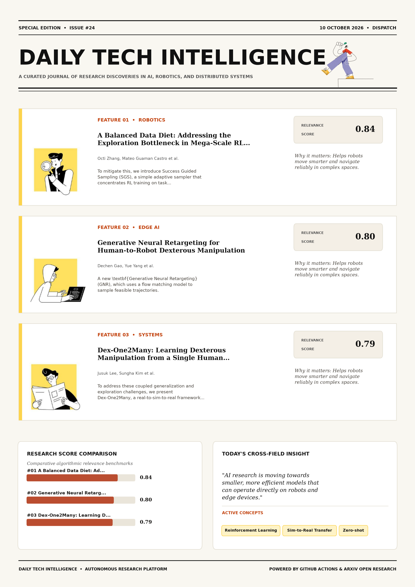

# Daily Tech Intelligence

## 10 October 2026

### Today's Overview

10 research papers analyzed.

Topics:

* Artificial Intelligence
* Machine Learning
* Robotics

### Visual Intelligence Templates

* **Template 3: Gen-Z Spotlight Broadside (Primary)**: [View High-Res](infographic_spotlight.png)
* **Template 2: Modern Tech Studio**: [View High-Res](infographic_modern.png)
* **Template 1: Editorial Research Journal**: [View High-Res](infographic_editorial.png)

---

## 1. A Balanced Data Diet: Addressing the Exploration Bottleneck in Mega-Scale RL for Robot Control

Authors: Octi Zhang, Mateo Guaman Castro, Patrick Yin, Ignacio Dagnino, Abhishek Gupta, Rosario Scalise, Byron Boots

Publication: 2026-10-08T17:59:50Z

Category: cs.RO, cs.LG

Relevance Score: 0.84

Paper: [arXiv:2610.12465](https://arxiv.org/abs/2610.12465v1) | [PDF](https://arxiv.org/pdf/2610.12465v1)

### Summary

However, we find that naively scaling this paradigm to more precise or dynamic problems remains non-trivial. To mitigate this, we introduce Success Guided Sampling (SGS), a simple adaptive sampler that concentrates RL training on task configurations around the frontier of the policy's capabilities. Across experiments using up to 2^{20} (over one million) parallel environments, SGS enables RL to solve challenging multi-terrain quadruped locomotion and contact-rich assembly tasks that prior methods fail to solve. Project website: https://sgs-rl.github.io/. General-purpose robots must perform a wide range of tasks from agile locomotion to dexterous manipulation. While sim-to-real reinforcement learning (RL) has proven to be a useful tool for this goal, current RL pipelines depend on engineering-heavy, per-task structural priors such as shaped rewards and demonstrations.

### Key Concepts

* Reinforcement Learning
* Sim-to-Real Transfer
* Zero-shot
* Dexterous Manipulation
* Manipulation
* Parallel Environments

### Technical Insights

**Problem**

However, we find that naively scaling this paradigm to more precise or dynamic problems remains non-trivial.

**Approach**

To mitigate this, we introduce Success Guided Sampling (SGS), a simple adaptive sampler that concentrates RL training on task configurations around the frontier of the policy's capabilities.

**Key Innovation**

Formulates an integrated mechanism leveraging Reinforcement Learning, Sim-to-Real Transfer.

**Results**

Across experiments using up to 2^{20} (over one million) parallel environments, SGS enables RL to solve challenging multi-terrain quadruped locomotion and contact-rich assembly tasks that prior methods fail to solve.

**Applications**

Autonomous robotic manipulation, sim-to-real transfer, and agile mobile navigation systems.

**Limitations**

Not specified in the available abstract.

---

## 2. Generative Neural Retargeting for Human-to-Robot Dexterous Manipulation

Authors: Dechen Gao, Yue Yang, Ben Abbatematteo, Nathan Godwin, Pengcheng Wang, Roger Boldu, Steven Man, Zhiyang Dou, Chuan Qin, Sho Nakagome, Eric Whitmire

Publication: 2026-10-08T17:57:58Z

Category: cs.RO

Relevance Score: 0.80

Paper: [arXiv:2610.12440](https://arxiv.org/abs/2610.12440v1) | [PDF](https://arxiv.org/pdf/2610.12440v1)

### Summary

Reinforcement learning (RL) and sampling-based model predictive control (MPC) are commonly employed to yield dynamically feasible motions, but both are sample-inefficient and sensitive to hyperparameters. We propose \textbf{Generative Neural Retargeting} (GNR), which uses a flow matching model to sample feasible trajectories. GNR outperforms MPC with only 8.5\% of the samples required by MPC, achieving a success rate of 56.20\% compared to 27.20\% for MPC. GNR can be used for scalable and efficient retargeting of large-scale, long-horizon, and millimeter precision human demonstrations: by applying GNR within a real-to-sim data engine, we produce a dexterous manipulation dataset with dense contact-force labels, spanning 223k demonstrations and 3.3k object geometries.

### Key Concepts

* Reinforcement Learning
* Dexterous Manipulation
* Manipulation
* Dynamically Feasible
* Feasible Trajectories
* Shared Demonstrations Retargeting

### Technical Insights

**Problem**

Reinforcement learning (RL) and sampling-based model predictive control (MPC) are commonly employed to yield dynamically feasible motions, but both are sample-inefficient and sensitive to hyperparameters.

**Approach**

We propose \textbf{Generative Neural Retargeting} (GNR), which uses a flow matching model to sample feasible trajectories.

**Key Innovation**

Formulates an integrated mechanism leveraging Reinforcement Learning, Dexterous Manipulation.

**Results**

GNR outperforms MPC with only 8.5\% of the samples required by MPC, achieving a success rate of 56.20\% compared to 27.20\% for MPC.

**Applications**

Autonomous robotic manipulation, sim-to-real transfer, and agile mobile navigation systems.

**Limitations**

Not specified in the available abstract.

---

## 3. Dex-One2Many: Learning Dexterous Manipulation from a Single Human Demonstration

Authors: Jusuk Lee, Sungha Kim, Yeonsoo Park, Jonguk Cheon, Yoonkyo Jung, Yongjun You, H. Jin Kim, Jia-Bin Huang, Furong Huang, Youngseok Jang, Seungjae Lee

Publication: 2026-10-08T17:59:58Z

Category: cs.RO, cs.CV

Relevance Score: 0.79

Paper: [arXiv:2610.12470](https://arxiv.org/abs/2610.12470v1) | [PDF](https://arxiv.org/pdf/2610.12470v1)

### Summary

While learning dexterous manipulation from a single human video offers a promising alternative to costly robot demonstrations, many recent methods predominantly imitate demonstrated motions. To address these coupled generalization and exploration challenges, we present Dex-One2Many, a real-to-sim-to-real framework that learns a generalizable dexterous manipulation policy from a single human video. Alternatively, discovering a policy via reinforcement learning (RL) allows for broad generalization, but without prior guidance, it struggles with high-dimensional exploration in complex, multi-stage tasks. Across five tool-use and manipulation tasks, Dex-One2Many exceeds baselines by 6.5% in seen configurations, while its robust generalization widens this gap to 71% in unseen scenarios.

### Key Concepts

* Reinforcement Learning
* Sim-to-Real Transfer
* Zero-shot
* Dexterous Manipulation
* Manipulation
* Abstract Video

### Technical Insights

**Problem**

While learning dexterous manipulation from a single human video offers a promising alternative to costly robot demonstrations, many recent methods predominantly imitate demonstrated motions.

**Approach**

To address these coupled generalization and exploration challenges, we present Dex-One2Many, a real-to-sim-to-real framework that learns a generalizable dexterous manipulation policy from a single human video.

**Key Innovation**

Formulates an integrated mechanism leveraging Reinforcement Learning, Sim-to-Real Transfer.

**Results**

Not specified in the available abstract.

**Applications**

Autonomous robotic manipulation, sim-to-real transfer, and agile mobile navigation systems. High-resolution real-time visual perception, automated 3D reconstruction, and embodied vision.

**Limitations**

The graphs serve as generative constraints for sampling diverse reset states and provide dense rewards for each stage.

---

## 4. VioLA: Learning Generalist Humanoid Control Policies from Human Data

Authors: Mert Albaba, Jens Beißwenger, Anna Manasyan, Daniel Marta, Michael J. Black, Wieland Brendel, Andreas Krause, Georg Martius, Martin Riedmiller

Publication: 2026-10-08T17:57:27Z

Category: cs.RO, cs.LG

Relevance Score: 0.79

Paper: [arXiv:2610.12435](https://arxiv.org/abs/2610.12435v1) | [PDF](https://arxiv.org/pdf/2610.12435v1)

### Summary

Its action space is large and tightly coupled: legs, arms, and fingers must move together while the robot keeps its balance, which makes joint-level actions hard to learn. We introduce VioLA, a generalist humanoid policy that predicts body and hand motion latents instead of joint commands. And humanoid demonstrations are scarce, so current humanoid generalist policies do not follow new instructions out of the box and are fine-tuned on teleoperated demonstrations of each task before deployment. Code and checkpoints will be released. Teaching a humanoid to follow instructions with its whole body runs into two obstacles. Human demonstrations exist in far larger numbers, but a person's motion is not a robot command.

### Key Concepts

* World-action Model
* Zero-shot
* Manipulation
* Action Space
* Generalist Policy
* Policy Predicts

### Technical Insights

**Problem**

Its action space is large and tightly coupled: legs, arms, and fingers must move together while the robot keeps its balance, which makes joint-level actions hard to learn.

**Approach**

We introduce VioLA, a generalist humanoid policy that predicts body and hand motion latents instead of joint commands.

**Key Innovation**

Formulates an integrated mechanism leveraging World-action Model, Zero-shot.

**Results**

Not specified in the available abstract.

**Applications**

Autonomous robotic manipulation, sim-to-real transfer, and agile mobile navigation systems.

**Limitations**

Not specified in the available abstract.

---

## 5. ARC: A Reasoning Recipe for Robot Foundation Models

Authors: Gokul Puthumanaillam, Tao Sun, Elie Aljalbout, Moritz Reuss, Zhaoshuo Li, Fabio Ramos, Ankit Goyal, Jenai Xuning Yang

Publication: 2026-10-08T17:38:04Z

Category: cs.RO, cs.AI

Relevance Score: 0.79

Paper: [arXiv:2610.12386](https://arxiv.org/abs/2610.12386v1) | [PDF](https://arxiv.org/pdf/2610.12386v1)

### Summary

The prevailing approach to improving robot foundation models (RFMs) relies on larger models, more robot demonstrations, and costly training at scale. We show that there exists an effective and efficient complementary approach: the right reasoning recipe can substantially improve the zero-shot task performance of existing state-of-the-art RFMs. Using ARC, we obtain gains in zero-shot RFM performance that, to our knowledge, are unprecedented without additional robot demonstrations or foundation-scale training. The adapted models establish a new state of the art on RoboLab-120 and MolmoSpaces, with gains of up to 50 percentage points on RoboLab-Reasoning-50. Project website: https://arc-robot-reasoning.github.io/ We refer to this recipe as ARC.

### Key Concepts

* Zero-shot
* Action Appropriate
* Action Explain
* Adapting Pretrained
* Additional Robot
* Arc Consists

### Technical Insights

**Problem**

The prevailing approach to improving robot foundation models (RFMs) relies on larger models, more robot demonstrations, and costly training at scale.

**Approach**

We show that there exists an effective and efficient complementary approach: the right reasoning recipe can substantially improve the zero-shot task performance of existing state-of-the-art RFMs.

**Key Innovation**

Using ARC, we obtain gains in zero-shot RFM performance that, to our knowledge, are unprecedented without additional robot demonstrations or foundation-scale training.

**Results**

The adapted models establish a new state of the art on RoboLab-120 and MolmoSpaces, with gains of up to 50 percentage points on RoboLab-Reasoning-50.

**Applications**

Autonomous robotic manipulation, sim-to-real transfer, and agile mobile navigation systems.

**Limitations**

Not specified in the available abstract.

---

## 6. RoboRSI: Stable, efficient, and reusable robot self-evolution in complex real-world environments

Authors: Zimo Wen, Yijin Chen, Yuxuan Cao, Wendi Chen, Yanwen Zou, Wenye Yu, Fuhang Kuang, Han Xue, Jun Lv, Chuan Wen, Cewu Lu

Publication: 2026-10-08T17:55:12Z

Category: cs.RO, cs.AI

Relevance Score: 0.74

Paper: [arXiv:2610.12424](https://arxiv.org/abs/2610.12424v1) | [PDF](https://arxiv.org/pdf/2610.12424v1)

### Summary

Robot agents that act through code can already repair programs from execution feedback, yet it remains a central challenge to organize this experience around the task structure that gives it meaning, so that each repair is attributed to the responsible capability, supported by execution evidence, and validated before it is reused. We introduce RoboRSI, a robot self-improvement system built on Top-Down Skill Refinement (TSR). In simulation, it achieves the highest success rate on LIBERO, LIBERO-PRO, LIBERO-Plus, and RoboTwin, exceeding the strongest baseline by 2.7 to 11.0 percentage points. A generalist robot should not only perform diverse tasks but also improve through experience, turning what it learns during execution into capabilities that later tasks can reuse.

### Key Concepts

* Achieves Highest
* Act Code
* Atomic Base
* Attributed Responsible
* Attributes Execution
* Base Skills

### Technical Insights

**Problem**

Robot agents that act through code can already repair programs from execution feedback, yet it remains a central challenge to organize this experience around the task structure that gives it meaning, so that each repair is attributed to the responsible capability, supported by execution evidence, and validated before it is reused.

**Approach**

We introduce RoboRSI, a robot self-improvement system built on Top-Down Skill Refinement (TSR).

**Key Innovation**

Formulates an integrated mechanism leveraging Achieves Highest, Act Code.

**Results**

Not specified in the available abstract.

**Applications**

Autonomous robotic manipulation, sim-to-real transfer, and agile mobile navigation systems.

**Limitations**

Not specified in the available abstract.

---

## 7. LiteNWM: Efficient Latent World Models for Onboard Visual Navigation in the Wild

Authors: Linkai Liu, Yuntian Zhang, Zhenshan Bing, Chen Chen, Lingjuan Lyu, Shangguang Wang, Mengwei Xu, Dongqi Cai

Publication: 2026-10-08T17:29:04Z

Category: cs.RO

Relevance Score: 0.74

Paper: [arXiv:2610.12368](https://arxiv.org/abs/2610.12368v1) | [PDF](https://arxiv.org/pdf/2610.12368v1)

### Summary

Generative navigation world models provide this foresight through visual rollouts, which are costly when evaluating multiple candidates. We present LiteNWM, a latent navigation world model that shares visual encoding across candidates and jointly predicts their action-conditioned future representations at multiple horizons, while a learned scorer uses these predictions to select trajectories. These results demonstrate that LiteNWM can be deployed for future-aware planning and closed-loop navigation on a physical robot. Direct visual navigation policies generate trajectories efficiently but do not explicitly evaluate their future consequences. In offline evaluations on RECON, SCAND, and SACSoN, LiteNWM reduces macro-averaged trajectory error by 17.56% relative to NoMaD+NWM-XL and achieves a 128.00-fold end-to-end speedup on an RTX 5090.

### Key Concepts

* World Model
* Achieves Fold
* Candidates Jointly
* Closed-loop Navigation
* Consequences Generative
* Costly Evaluating

### Technical Insights

**Problem**

Generative navigation world models provide this foresight through visual rollouts, which are costly when evaluating multiple candidates.

**Approach**

We present LiteNWM, a latent navigation world model that shares visual encoding across candidates and jointly predicts their action-conditioned future representations at multiple horizons, while a learned scorer uses these predictions to select trajectories.

**Key Innovation**

Formulates an integrated mechanism leveraging World Model, Achieves Fold.

**Results**

Not specified in the available abstract.

**Applications**

Autonomous robotic manipulation, sim-to-real transfer, and agile mobile navigation systems.

**Limitations**

Not specified in the available abstract.

---

## 8. One Block, Multiple Depths: Recurrent Vision Transformers with Depth-Programmed Experts

Authors: Adrian Bulat, Yassine Ouali, Georgios Tzimiropoulos

Publication: 2026-10-08T17:58:36Z

Category: cs.CV, cs.LG

Relevance Score: 0.73

Paper: [arXiv:2610.12448](https://arxiv.org/abs/2610.12448v1) | [PDF](https://arxiv.org/pdf/2610.12448v1)

### Summary

Addressing critical demands in Machine Learning, this research investigates in this work, we show that a single transformer block, applied recurrently, can match the accuracy of a full-depth vision encoder at comparable inference flops without intermediate feature distillation. In this work, we show that a single Transformer block, applied recurrently, can match the accuracy of a full-depth vision encoder at comparable inference FLOPs without intermediate feature distillation. A continuous normalized-depth coordinate programs this mixture, defining a resampleable trajectory through FFN parameter space. For fixed-depth deployment, the recurrent block can be materialized as a conventional dense graph, removing online routing and merging without changing the one-FFN-per-depth compute but expanding deployment storage.

### Key Concepts

* Accuracy Fewer
* Accuracy Full-depth
* Accuracy Transfers
* Adaptations Identify
* Ahead Token-dispatch
* Applied Recurrently

### Technical Insights

**Problem**

Addresses foundational constraints in Machine Learning and existing computational workflows.

**Approach**

In this work, we show that a single Transformer block, applied recurrently, can match the accuracy of a full-depth vision encoder at comparable inference FLOPs without intermediate feature distillation.

**Key Innovation**

Formulates an integrated mechanism leveraging Accuracy Fewer, Accuracy Full-depth.

**Results**

Not specified in the available abstract.

**Applications**

High-resolution real-time visual perception, automated 3D reconstruction, and embodied vision.

**Limitations**

Not specified in the available abstract.

---

## 9. SpatialHarness: Test-Time Spatial Scaffolding for Fine Robotic Manipulation

Authors: Jiayu Wang, Yue Yu, Bin Zhu, Zhiyao Yang, Jingjing Chen

Publication: 2026-10-08T17:59:20Z

Category: cs.RO

Relevance Score: 0.72

Paper: [arXiv:2610.12457](https://arxiv.org/abs/2610.12457v1) | [PDF](https://arxiv.org/pdf/2610.12457v1)

### Summary

Addressing critical demands in Robotics, this research investigates frontier multimodal foundation models (e.g., gpt-6 astra) have recently shown strong potential for direct robotic control, yet their performance on fine manipulation remains limited. We introduce SpatialHarness, a test-time embodied harness that provides test-time spatial scaffolding for fine robotic manipulation without policy fine-tuning or changes to the physical sensing setup. Project website: https://emilia113.github.io/SpatialHarness/. Frontier multimodal foundation models (e.g., GPT-6 Astra) have recently shown strong potential for direct robotic control, yet their performance on fine manipulation remains limited. We argue that an important source of failure is not necessarily insufficient policy capability, but insufficient spatial observability, where task-critical spatial relationships may be poorly revealed by the existing physical camera setup.

### Key Concepts

* Manipulation
* Test-time Spatial
* Gpt- Astra
* Multimodal Foundation
* Simulated Scene
* Spatial Observability

### Technical Insights

**Problem**

Addresses foundational constraints in Robotics and existing computational workflows.

**Approach**

We introduce SpatialHarness, a test-time embodied harness that provides test-time spatial scaffolding for fine robotic manipulation without policy fine-tuning or changes to the physical sensing setup.

**Key Innovation**

Formulates an integrated mechanism leveraging Manipulation, Test-time Spatial.

**Results**

Not specified in the available abstract.

**Applications**

Autonomous robotic manipulation, sim-to-real transfer, and agile mobile navigation systems.

**Limitations**

Not specified in the available abstract.

---

## 10. A Physics-Informed Collision Learning Framework for Collaborative Robot Motion Generation

Authors: Chen Cai, Steven Liu

Publication: 2026-10-08T17:45:04Z

Category: cs.RO, eess.SY

Relevance Score: 0.72

Paper: [arXiv:2610.12404](https://arxiv.org/abs/2610.12404v1) | [PDF](https://arxiv.org/pdf/2610.12404v1)

### Summary

Classical geometry checkers provide reliable distances but are difficult to use inside gradient-based model predictive control, while conservative proxy models can restrict tightly coupled motion. We present PI-UDF, a physics-informed unified differentiable framework for body-to-body collision distance prediction between articulated robots. Hardware experiments and offline Drake/FCL replay show that PI-UDF provides a differentiable inter-arm clearance estimate suitable for closed-loop collision-aware collaborative robot motion generation. Close-proximity multi-arm manipulation requires collision models that are both geometrically accurate and differentiable enough for real-time optimization. PI-UDF combines analytical forward kinematics with learnable link-geometry embeddings and a shared residual network to predict pairwise inter-arm distances directly from robot configurations.

### Key Concepts

* Manipulation
* Accurate Differentiable
* Analytical Forward
* Arm Hardware
* Articulated Robots
* Asymmetric Boundary-crossing

### Technical Insights

**Problem**

Classical geometry checkers provide reliable distances but are difficult to use inside gradient-based model predictive control, while conservative proxy models can restrict tightly coupled motion.

**Approach**

We present PI-UDF, a physics-informed unified differentiable framework for body-to-body collision distance prediction between articulated robots.

**Key Innovation**

Formulates an integrated mechanism leveraging Manipulation, Accurate Differentiable.

**Results**

Not specified in the available abstract.

**Applications**

Autonomous robotic manipulation, sim-to-real transfer, and agile mobile navigation systems.

**Limitations**

Not specified in the available abstract.

---
